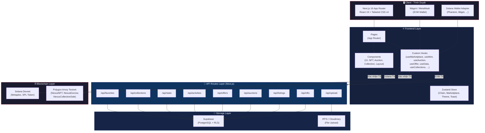
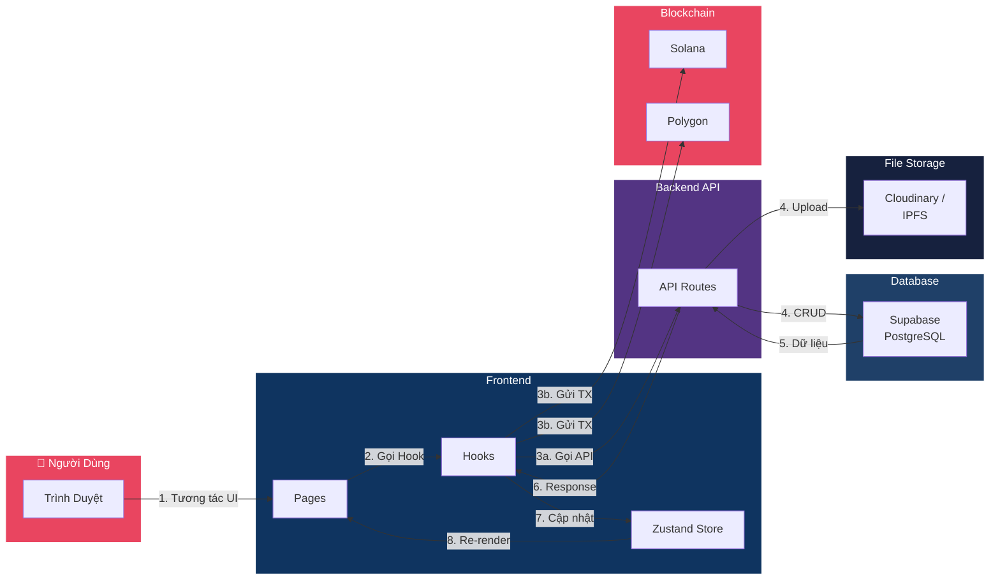
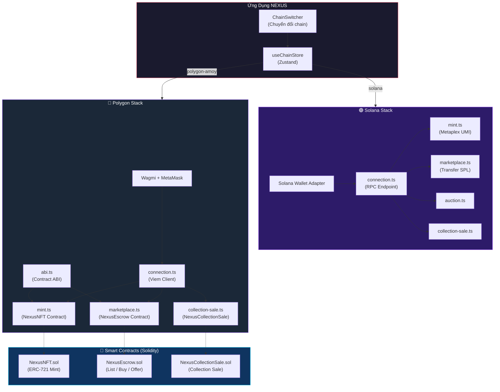
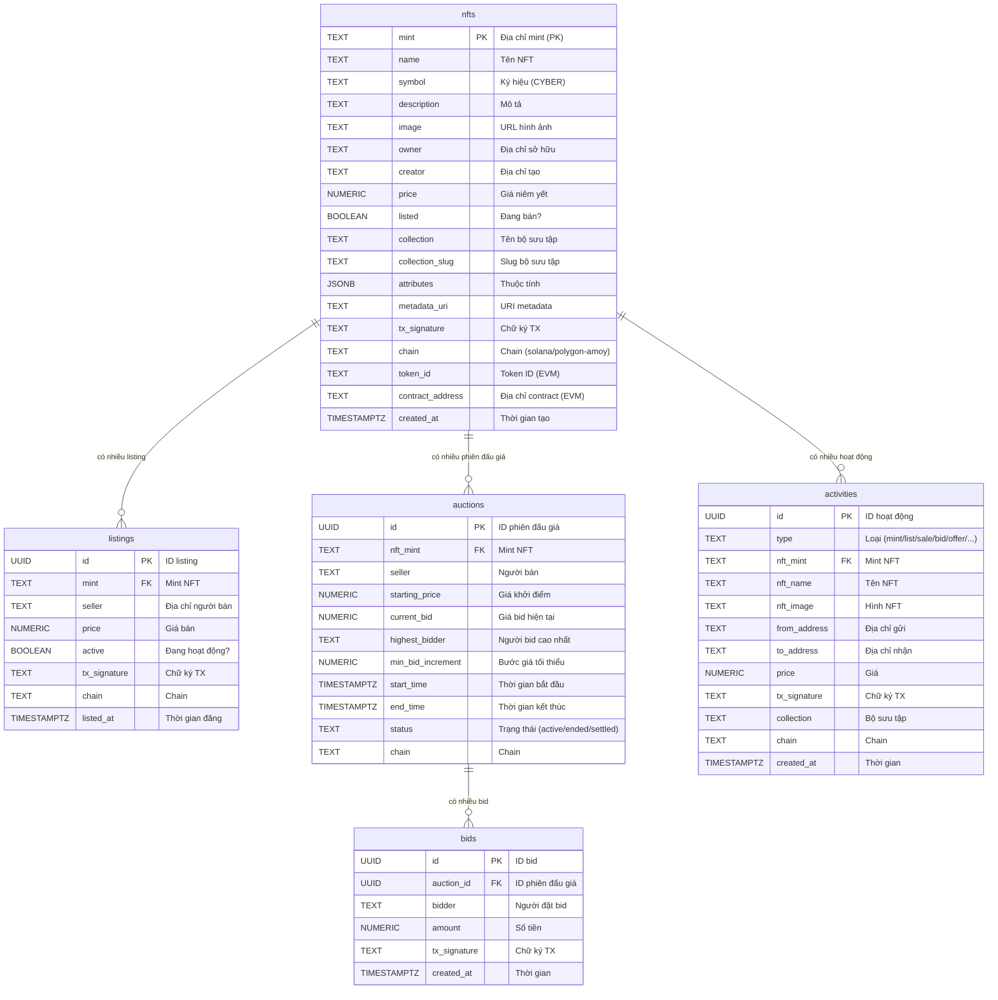
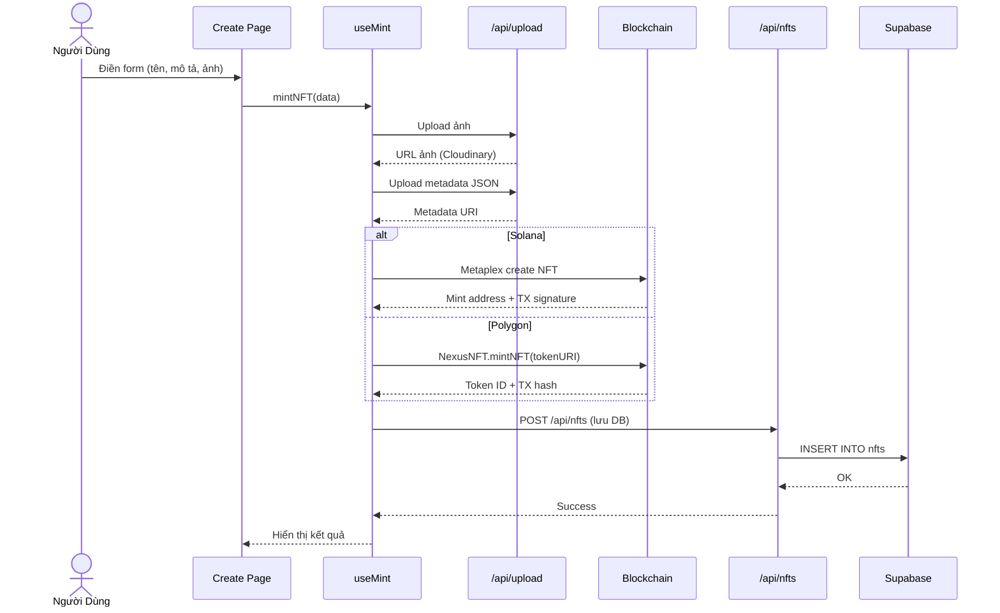
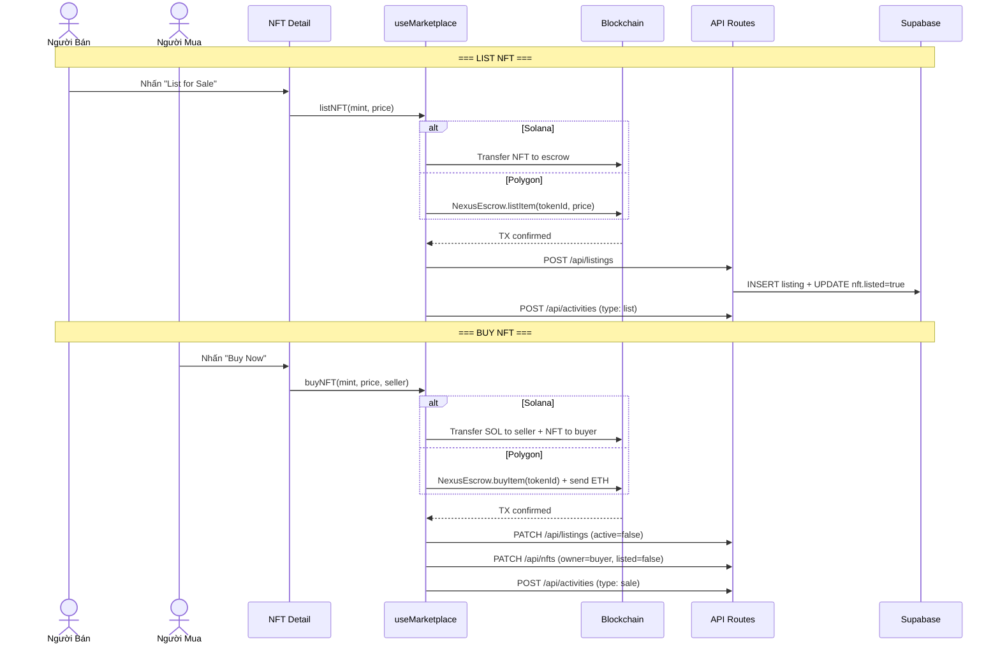
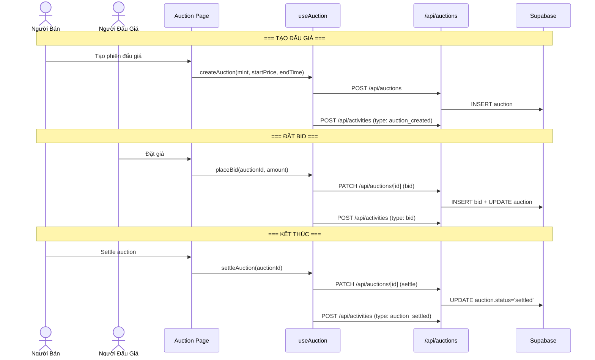
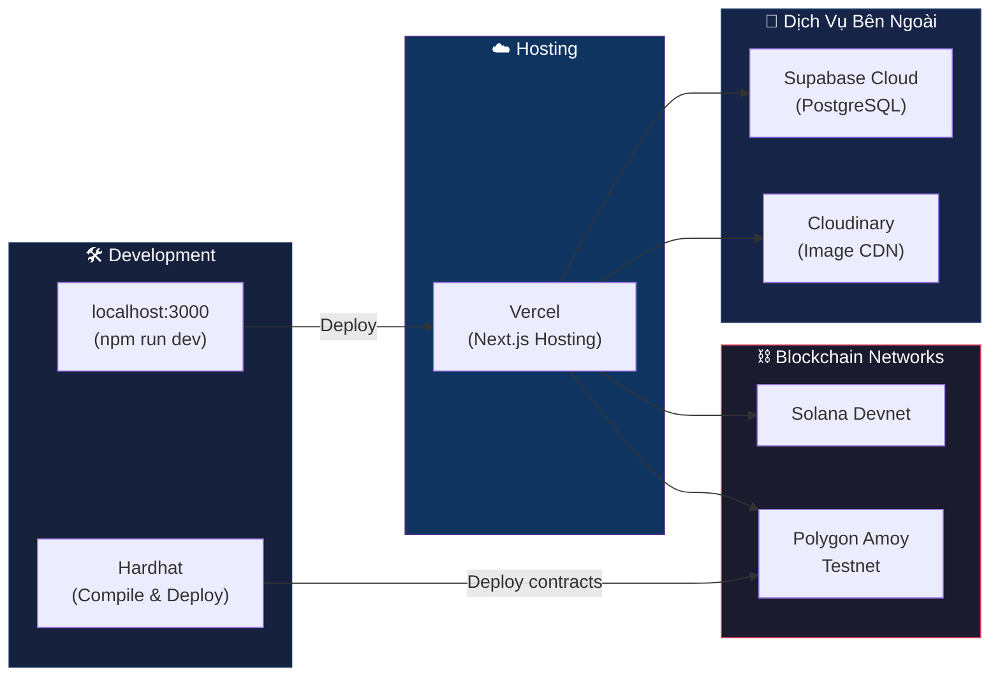

# NEXUS NFT Marketplace — Sơ Đồ Kiến Trúc & Cấu Trúc Thư Mục

> Tài liệu phục vụ báo cáo Word — Phiên bản hiện tại (không bao gồm Bridge)

---

## 1. Sơ Đồ Kiến Trúc Tổng Quan Hệ Thống



---

## 2. Sơ Đồ Luồng Dữ Liệu (Data Flow)



---

## 3. Sơ Đồ Kiến Trúc Multi-Chain



---

## 4. Sơ Đồ Cơ Sở Dữ Liệu (ERD)



---

## 5. Sơ Đồ Component (Frontend)

```mermaid
graph TB
    subgraph ROOT["🏠 App Root"]
        LAYOUT["layout.tsx<br/>(RootLayout)"]
        PROVIDERS["providers.tsx<br/>(ThemeProvider, WagmiProvider,<br/>SolanaWalletProvider, QueryClient)"]
    end

    subgraph LAYOUT_COMP["📐 Layout Components"]
        HEADER["Header.tsx<br/>(Navigation, Logo, Search)"]
        FOOTER["Footer.tsx<br/>(Links, Copyright)"]
        CHAIN_SW["ChainSwitcher.tsx<br/>(Solana ↔ Polygon)"]
        WALLET_BTN["ChainWalletButton.tsx<br/>(Connect Wallet)"]
        WALLET_MODAL["WalletPickerModal.tsx<br/>(Chọn ví)"]
    end

    subgraph NFT_COMP["🖼️ NFT Components"]
        NFT_CARD["NFTCard.tsx<br/>(Thẻ NFT)"]
        NFT_GRID["NFTGrid.tsx<br/>(Lưới NFT)"]
        PRICE_CHART["PriceChart.tsx<br/>(Biểu đồ giá)"]
        TRANSFER["TransferModal.tsx<br/>(Chuyển NFT)"]
    end

    subgraph AUCTION_COMP["⏱️ Auction Components"]
        AUCTION_CARD["AuctionCard.tsx<br/>(Thẻ đấu giá)"]
        COUNTDOWN["Countdown.tsx<br/>(Đếm ngược)"]
    end

    subgraph COLL_COMP["📦 Collection Components"]
        COLL_CARD["CollectionCard.tsx"]
        COLL_BANNER["CollectionBanner.tsx"]
        COLL_MANAGE["CollectionManageForm.tsx"]
        COLL_PICKER["CollectionPicker.tsx"]
        BUY_COLL["BuyCollectionModal.tsx"]
        SELL_COLL["SellCollectionModal.tsx"]
    end

    subgraph UI_COMP["🎨 UI Components"]
        BADGE["Badge.tsx"]
        BUTTON["Button.tsx"]
        CARD["Card.tsx"]
        CHAIN_ICON["ChainIcon.tsx"]
        EMPTY["EmptyState.tsx"]
        INPUT["Input.tsx"]
        MODAL["Modal.tsx"]
        SKELETON["Skeleton.tsx"]
        TOAST["ToastProvider.tsx"]
    end

    LAYOUT --> PROVIDERS
    LAYOUT --> HEADER
    LAYOUT --> FOOTER
    HEADER --> CHAIN_SW
    HEADER --> WALLET_BTN
    WALLET_BTN --> WALLET_MODAL

    NFT_GRID --> NFT_CARD
    NFT_CARD --> CHAIN_ICON
    NFT_CARD --> BADGE
    AUCTION_CARD --> COUNTDOWN
    COLL_BANNER --> BUTTON

    style ROOT fill:#1a1a2e,stroke:#e94560,color:#fff
    style LAYOUT_COMP fill:#16213e,stroke:#0f3460,color:#fff
    style NFT_COMP fill:#0f3460,stroke:#533483,color:#fff
    style AUCTION_COMP fill:#533483,stroke:#e94560,color:#fff
    style COLL_COMP fill:#162447,stroke:#1f4068,color:#fff
    style UI_COMP fill:#1b1b2f,stroke:#e94560,color:#fff
```



---

## 6. Sơ Đồ Cấu Trúc Thư Mục

```
NFT-Marketplace/
│
├── 📁 contracts/                      # Smart Contracts (Solidity)
│   ├── NexusNFT.sol                   #   ERC-721 NFT Contract
│   ├── NexusEscrow.sol                #   Marketplace Escrow (List/Buy/Offer)
│   └── NexusCollectionSale.sol        #   Collection Sale Contract
│
├── 📁 scripts/                        # Deployment & Migration Scripts
│   ├── deploy.cjs                     #   Deploy tất cả contracts
│   ├── deploy-escrow.cjs              #   Deploy NexusEscrow
│   ├── deploy-collection-sale.cjs     #   Deploy NexusCollectionSale
│   ├── fix-stuck-offers.cjs           #   Fix offer bị kẹt
│   ├── migrate-collections.ts         #   Migrate dữ liệu collection
│   └── seed.mjs                       #   Seed dữ liệu mẫu
│
├── 📁 supabase/                       # Database
│   ├── schema.sql                     #   Schema gốc
│   ├── create_tables.sql              #   Tạo bảng
│   ├── setup_rls.sql                  #   Row Level Security
│   ├── migration-phase1.sql           #   Migration phase 1
│   └── 📁 migrations/                 #   Các file migration
│
├── 📁 src/                            # Source Code Chính
│   │
│   ├── 📁 app/                        # Next.js App Router (Pages)
│   │   │
│   │   ├── 📁 api/                    # ═══ API Routes ═══
│   │   ├── 📁 explore/               # ═══ Trang Khám Phá ═══
│   │   ├── 📁 create/                # ═══ Trang Mint NFT ═══
│   │   ├── 📁 nft/                   # ═══ Chi Tiết NFT ═══
│   │   ├── 📁 auction/               # ═══ Chi Tiết Đấu Giá ═══
│   │   ├── 📁 auctions/              # ═══ Danh Sách Đấu Giá ═══
│   │   ├── 📁 collection/            # ═══ Chi Tiết Bộ Sưu Tập ═══
│   │   ├── 📁 collections/           # ═══ Danh Sách Bộ Sưu Tập ═══
│   │   ├── 📁 profile/               # ═══ Hồ Sơ Người Dùng ═══
│   │   ├── 📁 activity/              # ═══ Lịch Sử Hoạt Động ═══
│   │   └── 📁 stats/                 # ═══ Trang Thống Kê ═══
│   │
│   ├── 📁 components/                # ═══ React Components ═══
│   │   ├── 📁 layout/                #   Layout Components
│   │   ├── 📁 nft/                   #   NFT Components
│   │   ├── 📁 auction/               #   Auction Components
│   │   ├── 📁 collections/           #   Collection Components
│   │   └── 📁 ui/                    #   Reusable UI Components
│   │
│   ├── 📁 hooks/                     # ═══ Custom Hooks ═══
│   │
│   ├── 📁 lib/                       # ═══ Thư Viện & Utilities ═══
│   │   │
│   │   ├── 📁 abi/                   #   Contract ABIs
│   │   │   └── NexusEscrow.json      #     ABI NexusEscrow
│   │   │
│   │   ├── 📁 solana/                #   Solana-specific
│   │   │   ├── connection.ts         #     RPC connection
│   │   │   ├── mint.ts               #     Mint via Metaplex
│   │   │   ├── marketplace.ts        #     List/Buy/Delist
│   │   │   ├── auction.ts            #     Đấu giá Solana
│   │   │   └── collection-sale.ts    #     Bán collection
│   │   │
│   │   ├── 📁 polygon/               #   Polygon-specific
│   │   │   ├── config.ts             #     Wagmi config
│   │   │   ├── connection.ts         #     Viem client
│   │   │   ├── abi.ts                #     Contract ABI inline
│   │   │   ├── mint.ts               #     Mint via NexusNFT
│   │   │   ├── marketplace.ts        #     List/Buy via NexusEscrow
│   │   │   └── collection-sale.ts    #     Collection sale
│   │   │
│   │   └── 📁 ipfs/                  #   IPFS upload
│   │       └── upload.ts
│   │
│   ├── 📁 store/                     # ═══ State Management (Zustand) ═══
│   │
│   └── 📁 types/                     # ═══ TypeScript Types ═══
│
├── 📁 docs/                          # Tài liệu dự án
├── 📁 public/                        # Static assets
├── 📁 __tests__/                     # Unit tests
│
├── hardhat.config.cjs                # Hardhat config (Polygon contracts)
├── next.config.ts                    # Next.js config
├── package.json                      # Dependencies
├── tsconfig.json                     # TypeScript config
├── vitest.config.ts                  # Test config
└── eslint.config.mjs                 # Linting config
```

---

## 7. Sơ Đồ Luồng Xử Lý Chính

### 7.1 Luồng Mint NFT



### 7.2 Luồng List & Buy NFT



### 7.3 Luồng Đấu Giá (Auction)



---

## 8. Sơ Đồ Provider / Context

```mermaid
graph TB
    subgraph PROVIDER_TREE["🌳 Provider Tree"]
        THEME["ThemeProvider<br/>(next-themes)"]
        QUERY["QueryClientProvider<br/>(TanStack Query)"]
        WAGMI["WagmiProvider<br/>(Polygon EVM)"]
        SOL_CONN["ConnectionProvider<br/>(Solana RPC)"]
        SOL_WALLET["WalletProvider<br/>(Solana Wallets)"]
        SOL_MODAL["WalletModalProvider<br/>(Wallet UI)"]
        APP_CONTENT["App Content<br/>(Pages + Components)"]
    end

    THEME --> QUERY
    QUERY --> WAGMI
    WAGMI --> SOL_CONN
    SOL_CONN --> SOL_WALLET
    SOL_WALLET --> SOL_MODAL
    SOL_MODAL --> APP_CONTENT

    style PROVIDER_TREE fill:#1a1a2e,stroke:#e94560,color:#fff
    style THEME fill:#533483,stroke:#fff,color:#fff
    style QUERY fill:#0f3460,stroke:#fff,color:#fff
    style WAGMI fill:#8247e5,stroke:#fff,color:#fff
    style SOL_CONN fill:#9945ff,stroke:#fff,color:#fff
    style SOL_WALLET fill:#2d1b69,stroke:#fff,color:#fff
    style SOL_MODAL fill:#16213e,stroke:#fff,color:#fff
    style APP_CONTENT fill:#e94560,stroke:#fff,color:#fff
```



---

## 9. Sơ Đồ Deployment



---

## 10. Bảng Tóm Tắt Công Nghệ

| Thành Phần | Công Nghệ | Phiên Bản |
|---|---|---|
| **Framework** | Next.js (App Router) | 16.x |
| **UI Library** | React | 19.x |
| **Styling** | Tailwind CSS | v4 |
| **Animation** | Framer Motion | - |
| **State Management** | Zustand | - |
| **Data Fetching** | TanStack Query | - |
| **Database** | Supabase (PostgreSQL) | - |
| **Solana SDK** | @solana/web3.js, Metaplex UMI | - |
| **EVM SDK** | Wagmi, Viem | - |
| **Smart Contracts** | Solidity (Hardhat) | 0.8.x |
| **File Storage** | Cloudinary, IPFS | - |
| **Testing** | Vitest | - |
| **Linting** | ESLint | - |
| **Language** | TypeScript | 5.x |

---

> 📌 **Ghi chú**: Tất cả các sơ đồ Mermaid có thể copy trực tiếp vào công cụ render Mermaid hoặc xuất ra ảnh PNG/SVG để chèn vào báo cáo Word.
> 
> Công cụ gợi ý: [Mermaid Live Editor](https://mermaid.live) — Paste code Mermaid → Export PNG/SVG
