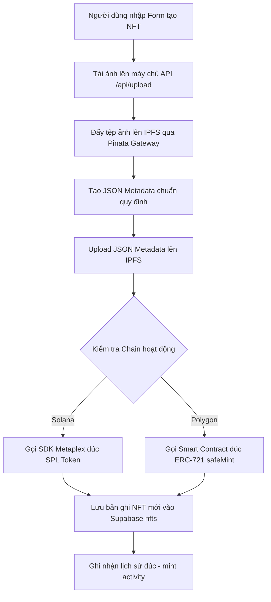
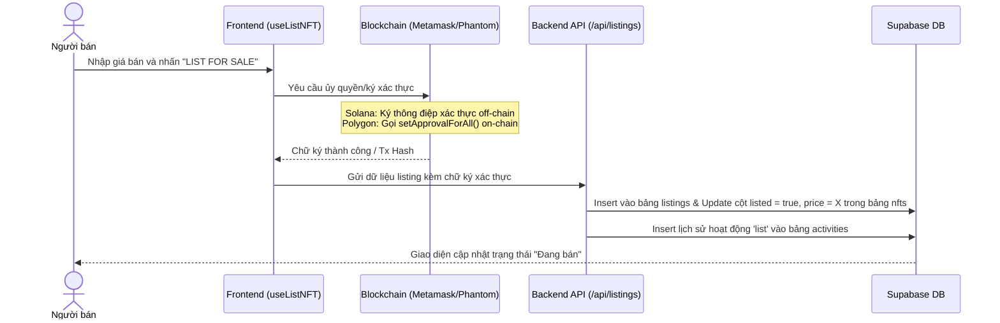

# 📄 BÁO CÁO CHI TIẾT CÁC CHỨC NĂNG HỆ THỐNG — NEXUS NFT MARKETPLACE

> **Tài liệu tham chiếu:** Phục vụ trực tiếp cho việc sao chép/chỉnh sửa nội dung đưa vào báo cáo môn học hoặc đồ án tốt nghiệp (Chương 3 - Thiết kế và Phân tích hệ thống).
> **Dự án:** NEXUS NFT Marketplace — Hỗ trợ đa chuỗi song song (Solana Devnet & Polygon Amoy) không cầu nối (Bridge-free).
> **Ngôn ngữ báo cáo:** Tiếng Việt.

---

## 📑 MỤC LỤC CHỨC NĂNG

```
1. TỔNG QUAN HỆ THỐNG PHÂN TÁC (HYBRID ARCHITECTURE)
2. CHỨC NĂNG 1: TẠO NFT MỚI (MINT NFT)
3. CHỨC NĂNG 2: ĐĂNG BÁN NFT (LIST SELL)
4. CHỨC NĂNG 3: MUA NFT TRỰC TIẾP (BUY NFT)
5. CHỨC NĂNG 4: ĐẤU GIÁ NFT (AUCTION & BIDS)
6. CHỨC NĂNG 5: ĐỀ XUẤT MUA ON-CHAIN (OFFERS WITH ESCROW)
7. CHỨC NĂNG 6: QUẢN LÝ BỘ SƯU TẬP (COLLECTIONS)
8. CHỨC NĂNG 7: LỊCH SỬ HOẠT ĐỘNG (ACTIVITY FEED)
9. CHỨC NĂNG 8: THỐNG KÊ CHI TIẾT (STATS & LEADERBOARDS)
```

---

## 1. TỔNG QUAN HỆ THỐNG PHÂN TÁC (HYBRID ARCHITECTURE)

Hệ thống NEXUS NFT Marketplace hoạt động theo kiến trúc kết hợp **Hybrid (On-chain + Off-chain)** nhằm đạt hiệu quả tối ưu giữa tính toàn vẹn tài sản và tốc độ trải nghiệm người dùng:
*   **Tầng On-chain (Blockchain):** Đảm nhiệm các giao dịch quan trạng cần tính phi tập trung, trustless tuyệt đối bao gồm: Đúc (Mint) NFT, chuyển khoản thanh toán khi Mua NFT, đặt cọc bảo đảm vào Escrow Smart Contract đối với các đề xuất mua (Offers), chuyển nhượng NFT (`transfer`).
*   **Tầng Off-chain (Supabase Database):** Đảm nhiệm việc lưu trữ các dữ liệu phụ trợ có tần suất thay đổi lớn, chi phí lưu trữ on-chain đắt đỏ hoặc đòi hỏi tốc độ truy vấn nhanh như: Lịch sử hoạt động (`activities`), trạng thái đăng bán hiện tại (`listings`), các phiên đấu giá (`auctions`), danh sách đề xuất mua (`offers`), danh mục bộ sưu tập (`collections`), lượt yêu thích (`favorites`).

---

## 2. CHỨC NĂNG 1: TẠO NFT MỚI (MINT NFT)

### 2.1. Quy trình Nghiệp vụ (Workflow)

Chức năng cho phép người dùng đúc một NFT mới lên blockchain (Solana hoặc Polygon) thông qua việc tải ảnh và tạo metadata theo chuẩn quy định.



### 2.2. Chi tiết Kỹ thuật theo Blockchain

#### A. Solana Devnet (SPL Token + Metaplex)
*   **Công nghệ:** Sử dụng `@solana/web3.js` kết hợp với chương trình metadata của Metaplex.
*   **Cơ chế:** Đúc một Token SPL với tổng lượng cung (supply) bằng 1, số thập phân (decimals) bằng 0. Tạo Associated Token Account (ATA) cho ví của người đúc và chuyển token vào đó. Đồng thời, gọi Instruction `CreateMetadataAccountV3` để ghi tên, ký hiệu (symbol) và đường dẫn URL JSON (IPFS) trực tiếp lên blockchain.

#### B. Polygon Amoy Testnet (Solidity ERC-721)
*   **Công nghệ:** Smart Contract `NexusNFT.sol` kế thừa chuẩn `ERC721` và `ERC721URIStorage` từ OpenZeppelin v5.
*   **Cơ chế:** Gọi hàm `safeMint(address to, string memory uri)` trên contract. Hàm này tự động sinh ID tuần tự `_nextTokenId++`, thực hiện đúc an toàn (`_safeMint`) tới ví người dùng và gán URI siêu dữ liệu (`_setTokenURI`).
*   **Mã nguồn Smart Contract (`NexusNFT.sol`):**
    ```solidity
    function safeMint(address to, string memory uri) public returns (uint256) {
        uint256 tokenId = _nextTokenId++;
        _safeMint(to, tokenId);
        _setTokenURI(tokenId, uri);
        emit NFTMinted(tokenId, to, uri);
        return tokenId;
    }
    ```

---

## 3. CHỨC NĂNG 2: ĐĂNG BÁN NFT (LIST SELL)

### 3.1. Quy trình Nghiệp vụ (Workflow)



### 3.2. Sự khác biệt kiến trúc giữa 2 Chain
*   **Trên Solana:** Sử dụng chữ ký số bảo đảm ý định (proof-of-intent). Người bán ký một thông điệp ghi nhận ý định bán NFT với mức giá nhất định. Dữ liệu này được lưu off-chain giúp người dùng **không mất phí gas** và không bị khóa tài sản khi niêm yết bán.
*   **Trên Polygon:** Để đảm bảo tính tin cậy tuyệt đối, người dùng thực hiện một giao dịch on-chain gọi hàm `setApprovalForAll(address operator, bool approved)` cấp quyền cho hợp đồng sàn giao dịch có thể đại diện chuyển giao NFT khi có người mua thanh toán đủ tiền, đảm bảo an toàn tuyệt đối chống rút sản phẩm bất hợp pháp.

---

## 4. CHỨC NĂNG 3: MUA NFT TRỰC TIẾP (BUY NFT)

### 4.1. Quy trình Nghiệp vụ (Workflow)

Mua đứt là chức năng thanh toán trực tiếp để sở hữu ngay NFT đang được niêm yết bán.

```mermaid
graph TD
    A[Người mua nhấn BUY NOW] --> B{Kiểm tra Blockchain hoạt động}
    
    B -- Solana -- G[Gửi giao dịch chuyển SOL trực tiếp từ ví người mua sang người bán]
    G --> I[Ví Solana thực thi xác nhận giao dịch thành công]
    
    B -- Polygon -- H[Gọi hàm mua trên Smart Contract chuyển POL cho người bán & chuyển giao NFT]
    H --> J[Ví MetaMask thực thi xác nhận giao dịch thành công]
    
    I --> K[Frontend gửi request lên API /api/nfts để đồng bộ dữ liệu]
    J --> K
    
    K --> L[Supabase cập nhật: owner = Người mua mới, listed = false, price = null]
    L --> M[Bảng listings: Cập nhật active = false hoặc xóa bản ghi đăng bán]
    M --> N[Insert vào bảng activities bản ghi lịch sử giao dịch 'sale']
```

### 4.2. Bảo mật khi thực thi giao dịch
*   Hệ thống kiểm tra tính hợp lệ của quyền sở hữu NFT on-chain (`verifyTokenOwnership`) trước khi gửi lệnh thực thi giao dịch mua nhằm loại bỏ rủi ro "bán lặp" hoặc dữ liệu DB lệch chuẩn so với trạng thái thực tế của Blockchain.

---

## 5. CHỨC NĂNG 4: ĐẤU GIÁ NFT (AUCTION & BIDS)

Hệ thống cung cấp cơ chế đấu giá kiểu Anh (English Auction): Đặt giá khởi điểm, người mua trả giá cao hơn, và quyết toán sau khi hết thời gian.

### 5.1. Khởi tạo đấu giá (`createAuction`)
*   Người sở hữu NFT thiết lập giá khởi điểm (Starting Price), bước giá tối thiểu (Min Increment) và thời gian kết thúc đấu giá.
*   NFT được đánh dấu trong cơ sở dữ liệu là đang đấu giá, khóa mọi chức năng mua đứt hoặc sửa giá thông thường.

### 5.2. Đặt giá đấu (`placeBid`)
*   Người tham gia đấu giá điền số tiền muốn trả (phải lớn hơn giá hiện tại cộng bước giá tối thiểu).
*   Giao dịch được ghi nhận vào bảng `bids` và cập nhật cột `current_bid` và `highest_bidder` trong bảng `auctions`.
*   *Đặc điểm thiết kế:* Hệ thống đấu giá on-chain đảm bảo minh bạch, ghi nhận thứ tự giá thầu chính xác tuyệt đối.

### 5.3. Quyết toán đấu giá (`settleAuction`)
Khi hết thời gian đấu giá, một trong hai bên có thể kích hoạt quyết toán:
*   **Người mua thắng cuộc:** Thực hiện thanh toán số tiền đấu trúng thầu cho người bán thông qua ví điện tử, Smart Contract chuyển giao quyền sở hữu NFT sang cho người mua thắng cuộc.
*   **Trường hợp không có người tham gia (No bids):** Phiên đấu giá đóng lại dưới trạng thái thất bại (`cancelled`/`expired`), NFT được hoàn trả trạng thái tự do ban đầu cho chủ sở hữu cũ.

---

## 6. CHỨC NĂNG 5: ĐỀ XUẤT MUA ON-CHAIN (OFFERS WITH ESCROW)

Để giải quyết vấn đề đề xuất mua ảo (người mua gửi đề xuất nhưng khi người bán đồng ý thì trong ví người mua không còn tiền), hệ thống triển khai **Smart Contract Escrow (Ký quỹ)** dành cho mạng Polygon.

### 6.1. Smart Contract Ký quỹ `NexusEscrow.sol`
Hợp đồng thông minh lưu trữ số tiền đặt cọc của người đề xuất để đảm bảo tính thanh khoản tuyệt đối.

```
                  ┌──────────────────────┐
                  │  NexusEscrow Contract│
                  └──────────┬───────────┘
            POL Funds Locked │
      ┌──────────────────────┼──────────────────────┐
      ▼                      ▼                      ▼
[Seller Accepts]       [Buyer Cancels]       [Seller Rejects]
POL ➔ Seller           POL ➔ Refunded        POL ➔ Refunded
NFT ➔ Buyer            Offer ➔ Inactive      Offer ➔ Inactive
```

### 6.2. Các hàm cốt lõi của hợp đồng:
*   `createOffer(address nftContract, uint256 tokenId, address seller)`: Người mua chuyển tiền POL vào contract khóa lại, khởi tạo mã ID đề xuất `offerId`.
*   `acceptOffer(uint256 offerId)`: Người bán đồng ý bán, NFT tự động chuyển sang người mua và tiền POL ký quỹ tự động giải phóng gửi về ví người bán.
*   `cancelOffer(uint256 offerId)`: Người mua tự hủy đề xuất khi chưa được duyệt, tiền POL được hoàn trả 100% về ví người mua.
*   `rejectOffer(uint256 offerId)`: Người bán từ chối đề xuất, tiền POL hoàn trả ngay lập tức cho người mua.

---

## 7. CHỨC NĂNG 6: QUẢN LÝ BỘ SƯU TẬP (COLLECTIONS)

Quản lý các nhóm tác phẩm nghệ thuật có cùng chủ đề giúp tăng tính phân cấp và chuyên nghiệp cho sàn giao dịch.

### 7.1. Cấu trúc dữ liệu bộ sưu tập trong Supabase (`collections`):
*   `name`: Tên bộ sưu tập (Ví dụ: "Cyber Punks Genesis").
*   `slug`: Đường dẫn URL chuẩn hóa (Ví dụ: "cyber-punks-genesis").
*   `logo`, `banner`: Tải lên IPFS đại diện thương hiệu cho bộ sưu tập.
*   `owner`: Người sáng lập bộ sưu tập.
*   `chain`: Phân định rõ ràng thuộc chuỗi blockchain nào (`solana` hoặc `polygon`).

### 7.2. Cơ chế tổng hợp động (Dynamic Aggregation):
Khi truy cập trang chi tiết bộ sưu tập, API backend thực hiện quét các bảng liên kết để tính toán các số liệu thống kê thời gian thực mà không dùng dữ liệu lưu cứng:
*   **Tổng số lượng vật phẩm (`items`):** `COUNT` tổng số NFT có `collection_id` trùng khớp.
*   **Số lượng chủ sở hữu (`owners`):** `COUNT(DISTINCT owner)` lọc các địa chỉ ví sở hữu duy nhất.
*   **Giá sàn (`floorPrice`):** Truy vấn mức giá niêm yết bán thấp nhất `MIN(price)` từ bảng `listings` của các NFT thuộc bộ sưu tập này.
*   **Tổng lượng giao dịch (`volume`):** Tổng doanh thu tích lũy `SUM(price)` từ các hoạt động thuộc thể loại `sale` trong bảng `activities`.

---

## 8. CHỨC NĂNG 7: LẠI LỊCH SỬ HOẠT ĐỘNG (ACTIVITY FEED)

Tracking mọi biến động tài sản xảy ra trong Marketplace để người dùng theo dõi lịch sử biến động thị trường.

### 8.1. Các loại hoạt động được ghi nhận (`ActivityType`):
*   `mint`: Hoạt động tạo tác phẩm mới.
*   `list`: Đăng bán tác phẩm lên sàn.
*   `cancel`: Hủy niêm yết bán.
*   `sale`: Giao dịch mua bán thành công.
*   `bid`: Lịch sử đặt giá đấu trong phiên đấu giá.
*   `offer`: Đề xuất mua ký quỹ.

### 8.2. Scoping theo Blockchain (Chain-Scoped)
Mỗi hoạt động khi phát sinh đều lưu trữ rõ giá trị `chain` tương ứng (`solana` hoặc `polygon`).
*   **Hoạt động tại đâu hiển thị tại đó:** Tại màn hình Lịch sử hoạt động của Solana chỉ hiển thị các bản ghi có `chain = 'solana'`, tương tự đối với Polygon. Điều này mang lại trải nghiệm chuyên biệt và tách bạch.

---

## 9. CHỨC NĂNG 8: THỐNG KÊ CHI TIẾT (STATS & LEADERBOARDS)

Bảng điều khiển trung tâm giúp người dùng phân tích hiệu năng hoạt động của toàn bộ sàn giao dịch.

### 9.1. Các Leaderboards chính:
*   **Top Collections:** Xếp hạng các bộ sưu tập hàng đầu dựa trên tổng khối lượng giao dịch tích lũy (`volume`) và giá sàn (`floorPrice`).
*   **Top Traders:** Vinh danh những địa chỉ ví hoạt động tích cực dựa trên tổng dung lượng giao dịch mua bán (`totalVolume = buyVolume + sellVolume`).
*   **Top Creators:** Vinh danh những người tạo tác xuất sắc dựa trên số lượng NFT đã đúc và doanh thu bán hàng lần đầu.

### 9.2. Cơ chế lọc Blockchain linh hoạt (Active-Chain Cache Invalidation)
*   Hệ thống sử dụng bộ lọc `chain` tại tham số URL API backend `/api/stats?chain=activeChain` để giới hạn các lệnh truy vấn `activities`, `nfts`, và `auctions` trong Supabase.
*   Frontend sử dụng thư viện `useQuery` (React Query) với khóa bộ nhớ đệm `queryKey: ['stats', activeChain]`. Khi người dùng thay đổi ví hoặc đổi Blockchain hoạt động tại thanh Header, cache sẽ tự động bị xóa bỏ, ép buộc gọi API mới để làm mới bảng xếp hạng stats sang mạng lưới blockchain tương ứng ngay lập tức!
