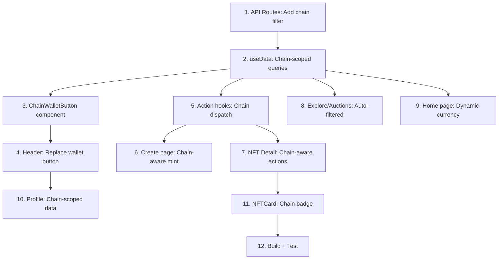

# Multi-Chain Separation — Phân tách Solana & Polygon

## Bối cảnh

Hiện tại NEXUS Marketplace có **cấu trúc hybrid** — cả Solana và Polygon code cùng tồn tại nhưng **chưa phân tách rõ ràng** ở tầng UI/UX:

### Hiện trạng

| Layer | Solana | Polygon | Vấn đề |
|-------|--------|---------|--------|
| **Wallet Provider** | ✅ Phantom/Solflare | ✅ MetaMask (wagmi) | Cả 2 load cùng lúc, lãng phí |
| **Chain Store** | ✅ `useChainStore` | ✅ | Chỉ toggle, không phân tách UX |
| **ChainSwitcher** | ✅ Dropdown | ✅ | Switcher tồn tại nhưng pages không filter theo chain |
| **NFT Type** | `chain: ChainId` | ✅ | DB có field `chain`, API **chưa filter** theo chain |
| **Explore** | `useFetchNFTs()` | Mixed | Hiển thị **tất cả NFT** bất kể chain |
| **Listings** | `useFetchListings()` | Mixed | Hiển thị **tất cả listings** bất kể chain |
| **Auctions** | Chỉ Solana | ❌ Không có Polygon auctions | Escrow-lite chỉ hoạt động cho Solana |
| **Create/Mint** | Solana mint | Polygon mint exists | Chỉ gọi Solana mint, Polygon mint không được wired |
| **Home page** | `formatSOL()` | ❌ hardcoded SOL | Luôn hiện SOL symbols |
| **API Routes** | Không filter chain | ❌ | `/api/nfts` trả về tất cả NFTs mọi chain |

### Mục tiêu

Khi user chọn **Solana** → Toàn bộ UI hiện Solana data, connect Phantom, mint trên Solana.
Khi user chọn **Polygon** → Toàn bộ UI hiện Polygon data, connect MetaMask, mint trên Polygon.

---

## Proposed Changes

### Component 1: API Layer — Chain-Aware Filtering

#### [MODIFY] [route.ts](file:///d:/Antigravity/NFT-Marketplace/src/app/api/nfts/route.ts)
- Thêm `chain` query param: `GET /api/nfts?chain=solana`
- Filter `query = query.eq('chain', chain)` khi chain được chỉ định
- Tương tự cho POST: yêu cầu field `chain` khi tạo NFT

#### [MODIFY] [route.ts](file:///d:/Antigravity/NFT-Marketplace/src/app/api/listings/route.ts)
- Thêm `chain` filter cho listings
- Join với `nfts` table để filter theo chain

#### [MODIFY] [route.ts](file:///d:/Antigravity/NFT-Marketplace/src/app/api/auctions/route.ts)
- Auctions hiện chỉ Solana → thêm chain field cho future Polygon auctions
- Filter `chain=solana` mặc định

#### [MODIFY] [route.ts](file:///d:/Antigravity/NFT-Marketplace/src/app/api/activities/route.ts)
- Thêm `chain` filter cho activities

---

### Component 2: Data Hooks — Chain-Scoped Queries

#### [MODIFY] [useData.ts](file:///d:/Antigravity/NFT-Marketplace/src/hooks/useData.ts)
- **Query keys** bao gồm `activeChain` → auto-refetch khi switch chain
- `useFetchNFTs()` → tự động gửi `chain` param từ `useChainStore`
- `useFetchListings()` → filter theo chain
- `useFetchAuctions()` → filter theo chain
- `useFetchActivities()` → filter theo chain
- Khi switch chain → `invalidateQueries` tự động

#### [MODIFY] [api.ts](file:///d:/Antigravity/NFT-Marketplace/src/lib/api.ts)
- `apiCreateNFT()` → thêm `chain` field
- `apiCreateListing()` → thêm `chain` field
- Các API functions khác tương tự

---

### Component 3: Wallet Connection — Chain-Specific

#### [MODIFY] [providers.tsx](file:///d:/Antigravity/NFT-Marketplace/src/app/providers.tsx)
- **Lazy-load wallet providers** — chỉ mount provider của chain đang active
- Hoặc: Keep cả 2 nhưng UI chỉ hiện Connect button phù hợp

#### [NEW] [ChainWalletButton.tsx](file:///d:/Antigravity/NFT-Marketplace/src/components/layout/ChainWalletButton.tsx)
- Thay thế `<WalletMultiButton />` (Solana-only)
- Khi `activeChain === 'solana'` → Phantom/Solflare connect
- Khi `activeChain === 'polygon'` → MetaMask connect (wagmi `useConnect`)
- Hiện balance đúng currency (SOL/POL)
- Profile link dựa trên wallet address của chain hiện tại

#### [MODIFY] [Header.tsx](file:///d:/Antigravity/NFT-Marketplace/src/components/layout/Header.tsx)
- Thay `<WalletMultiButton />` bằng `<ChainWalletButton />`
- Hiện balance bằng `formatChainCurrency()` thay vì hardcoded `formatSOL()`
- Mobile menu cũng dùng `<ChainWalletButton />`
- ChainSwitcher visible ở cả desktop lẫn mobile

---

### Component 4: Pages — Chain-Scoped UI

#### [MODIFY] [page.tsx (Home)](file:///d:/Antigravity/NFT-Marketplace/src/app/page.tsx)
- Hero section: Hiện chain icon/name động
- Trending/Featured: Chỉ hiện NFTs/Listings/Auctions của chain hiện tại
- Stats: Hiện stats theo chain
- Currency format: `formatChainCurrency()` thay `formatSOL()`

#### [MODIFY] [page.tsx (Explore)](file:///d:/Antigravity/NFT-Marketplace/src/app/explore/page.tsx)
- `useFetchNFTs()` tự động filter theo chain (từ Component 2)
- Filters: không cần "chain" filter vì đã scoped toàn cục

#### [MODIFY] [page.tsx (Auctions)](file:///d:/Antigravity/NFT-Marketplace/src/app/auctions/page.tsx)
- Khi chain=polygon: hiện "Auctions coming soon for Polygon" hoặc ẩn

#### [MODIFY] [page.tsx (Create)](file:///d:/Antigravity/NFT-Marketplace/src/app/create/page.tsx)
- Khi `solana` → gọi `mintNFT()` (existing Solana mint)
- Khi `polygon` → gọi `mintNFTPolygon()` (existing Polygon mint)
- UI hiện đúng cost estimate (SOL gas vs POL gas)
- Gửi `chain` field khi save vào DB

#### [MODIFY] [page.tsx (NFT Detail)](file:///d:/Antigravity/NFT-Marketplace/src/app/nft/[mint]/page.tsx)
- Hiện chain badge (◎ Solana / ▲ Polygon)
- Buy/List buttons gọi đúng chain function
- Explorer link → đúng chain explorer
- Transfer → gọi `transferNFT()` hoặc `transferNFTPolygon()`
- Price format: `formatChainCurrency()`

#### [MODIFY] [page.tsx (Profile)](file:///d:/Antigravity/NFT-Marketplace/src/app/profile/[address]/page.tsx)
- Hiện NFTs owned trên chain hiện tại
- Tab "All Chains" tùy chọn
- Balance dùng chain wallet

---

### Component 5: Hooks — Chain-Aware Actions

#### [MODIFY] [useMarketplace.ts](file:///d:/Antigravity/NFT-Marketplace/src/hooks/useMarketplace.ts)
- `useListNFT()` → check chain → gọi `listNFT()` (Solana) hoặc `listNFTPolygon()` (Polygon)
- `useBuyNFT()` → tương tự
- `useCancelListing()` → tương tự
- Thêm `chain` vào API calls khi save DB

#### [MODIFY] [useMint.ts](file:///d:/Antigravity/NFT-Marketplace/src/hooks/useMint.ts)
- Check `activeChain` → dispatch to correct mint function
- Gửi `chain` field khi `apiCreateNFT()`

#### [MODIFY] [useAuction.ts](file:///d:/Antigravity/NFT-Marketplace/src/hooks/useAuction.ts)
- Guard: chỉ cho phép auctions trên Solana (hiện tại)
- Future: mở rộng cho Polygon khi có smart contract

#### [MODIFY] [useBalance.ts](file:///d:/Antigravity/NFT-Marketplace/src/hooks/useBalance.ts)
- Merge logic từ `useChainWallet` vào
- Return balance theo chain hiện tại
- Airdrop chỉ available trên Solana Devnet

---

### Component 6: NFTCard — Chain Badge

#### [MODIFY] [NFTCard.tsx](file:///d:/Antigravity/NFT-Marketplace/src/components/nft/NFTCard.tsx)
- Hiện chain icon badge (◎/▲) ở góc card
- Price format dùng `formatChainCurrency()`

---

## Execution Order



| Phase | Tasks | Estimate |
|-------|-------|----------|
| **Phase A** | API routes + Data hooks (1-2) | ~30 min |
| **Phase B** | Wallet button + Header (3-4) | ~20 min |
| **Phase C** | Action hooks + Create + NFT Detail (5-7) | ~40 min |
| **Phase D** | Remaining pages + NFTCard (8-11) | ~20 min |
| **Phase E** | Build + Test + Fix (12) | ~15 min |

---

## Supabase Schema

> [!IMPORTANT]
> Cần đảm bảo table `nfts` đã có column `chain` (type `text`, default `'solana'`).
> Nếu chưa có, cần chạy migration:
> ```sql
> ALTER TABLE nfts ADD COLUMN IF NOT EXISTS chain text DEFAULT 'solana';
> ALTER TABLE listings ADD COLUMN IF NOT EXISTS chain text DEFAULT 'solana';
> ALTER TABLE auctions ADD COLUMN IF NOT EXISTS chain text DEFAULT 'solana';
> ALTER TABLE activities ADD COLUMN IF NOT EXISTS chain text DEFAULT 'solana';
> ```

---

## Open Questions

> [!IMPORTANT]
> **1. Cross-chain trong Explore?**
> Khi user ở Solana chain, muốn xem NFTs Polygon không? Hay hoàn toàn tách biệt?
> - **Option A:** Tách hoàn toàn — chỉ thấy NFTs của chain đang chọn
> - **Option B:** Có tab "All Chains" nhưng mặc định hiện chain hiện tại

> [!IMPORTANT]
> **2. Profile page scope?**
> Profile `/profile/{address}` — address Solana khác address Polygon. Khi switch chain:
> - **Option A:** Redirect về profile của wallet hiện tại
> - **Option B:** Hiện data cả 2 chain cho user đó (cần map address)

> [!IMPORTANT]
> **3. Polygon Auctions?**
> Hiện tại Escrow-Lite chỉ chạy trên Solana. Với Polygon:
> - **Option A:** Disable auctions cho Polygon, hiện "Coming soon"
> - **Option B:** Implement on-chain auction contract cho Polygon (phức tạp hơn nhiều)

---

## Verification Plan

### Build Check
```bash
npx next build    # Exit code 0, no type errors
npx vitest run    # All 88+ tests pass
```

### Manual Verification
1. Chọn Solana → Explore chỉ hiện Solana NFTs
2. Chọn Polygon → Explore chỉ hiện Polygon NFTs
3. Switch chain → Data tự reload, wallet button thay đổi
4. Mint trên Solana → NFT xuất hiện ở Solana explore
5. Mint trên Polygon → NFT xuất hiện ở Polygon explore
6. Buy/List → Gọi đúng chain function
7. Mobile → ChainSwitcher + wallet hoạt động tốt
